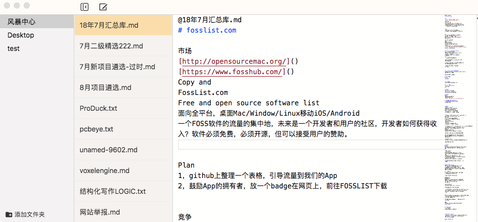

# MWriter

终极的支持插件的可定制的开源、免费的跨平台的markdown编辑器。

## 愿景
努力成为，一个以黑客（极客）为目标用户群的，可插件可扩展因而能够生态化发展的，非商业的自由开源的，以中文为首语言全球化发展的，以文档写作为核心的编辑器。

## 下载
[MWriter下载地址](http://mwriter.netqon.com)

## 版本历史
v0.1.0 2018年09月21日
完整的基础编辑功能

## 重要的计划中的功能
- 支持插件、脚本动作
使诸如“一键发布文章到专栏”，“上传图片到图床”，“一键更新到在线文档”等功能的轻松实现。
- 支持主题
由用户可以制作分享软件主题。
- HTML释出
支持单篇及目录整体的向HTML、PDF的释出。其中HTML释出亦支持主题。
重点支持以文件夹做为HTML输出来轻松制作文档。

[全部开发计划](https://github.com/fateleak/mwriter/issues)

## FaQ
- 何为以中文为首语言的全球化发展？
软件支持中英两种语言，但软件的文档、开发文档、用户之间的讨论将以中文为主。

## LISCENSE
MIT

